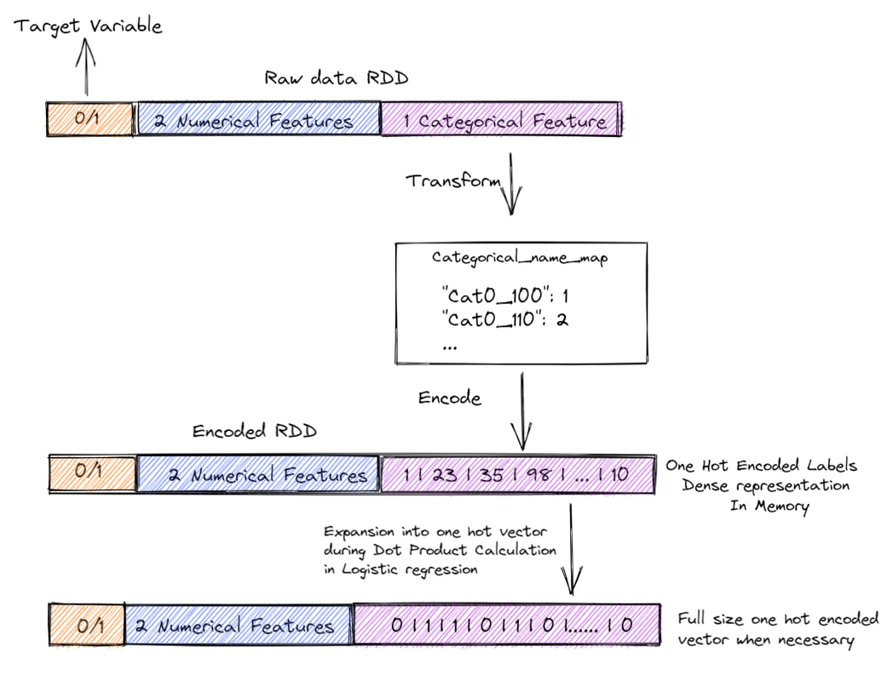

# Airline Partner Recommendation to Electronic Arts

## Introduction
Accurate prediction of flight delay is crucial for airlines and their customers because of the cascading consequences of any given flight anomaly on both the carriers and the passengers. Our motivation for creating models to predict flight delays is that we are a data science consultancy hired by Electronic Arts, a large corporation operating in the gaming industry to identify and recommend airline carriers to partner with for an exclusivity agreement. We aim to predict flight delays in advance so that we can help EA avoid missed opportunities company wide by anticipating and making sound decisions when these situations arise.

## Data
The datasets that we will leverage to develop predictive flight delay models include the following:

- Airline data from the US Department of Transportation containing flight information like flight number, origin airport, destination airport, time of flight, and delay status between 2015 and 2020.
- Weather data from the National Oceanic and Atmospheric Administration (NOAA) Integrated Surface Database from 2015 to 2020 containing sensor readings on wind speed, visibility, temperature, and dew point.
- A table of NOAA weather station locations that will be the key to joining both the weather and airline datasets

## Models
We experimented with decision tree (baseline model), logistic regression, random forest, XGBoost, and Gradient Boost, and adopted various methods to improve performance, such as rolling window cross validation, gridsearch, etc. We compared the performance of 4 models and decided to choose XGBoost as our champion model considering the balance between precision and recall. More details on model performance can be found in the report.ipynb. 

- Logistic Regression from Scratch 
-- Map Reduce for Gradient Descrent update
In order to implement Logistic Regression from scratch, we have to implement Gradient Descent steps to update the current model parameters. We applied Map Reduce method to implement Gradient update at scale. For every step, we first transform the DataRDD to the predictRDD via the sigmoid mapper function. Then, we compute the gradient using another mapper function to compute the dot product of all features and the delta between predicted value and actual value. Finally applying the regularzation parameters and the learning rate to form the new model.

-- Sparse and dense representation for one-hot encoding
In order to allow for further expansion of one-hot categories in future for modeling exploration and improvement, we make an optimization to expand to the full one-hot vector only when needed for computation. This will enable us for memory usage optimization, we process the RDD in its original form to store the one-hot indices in dense formation. Then it is broadcasted to all executers. During the subsequent dot product computations, we would transform the densed one-hot indices into the full one-hot vector dimensions for calculation. As a result, we never incur the memory overhead of storing the entire expanded one-hot encoded RDD in memory.

## Novel approach
Thinking about real life scenarios, one major reason flight delays is that the previous flight operated by the same aircraft was delayed, resulting in the subsequent flights not being operated as scheduled. We utilized the motif finding function in GraphFrame library to find the potential consecutive flights operated by the same aircraft. With additional features of the source airport, such as weather data at two time points and airport evaluation scores, we built Gradient Boost model to see if we could improve recall of predictions. Even thought the accuracy and recall is comparable to the model what without connection flight features, we leveraged novel network algorithm created new features for 80M records in this process. 

## Summary
The top 5 airline carriers recommended for exclusivity agreements with EA are the following:

1. AA - American Airlines
2. UA - United Airlines
3. WN - Southwest Airlines
4. OO - Skywest Airlines
5. DL - Delta Airlines

